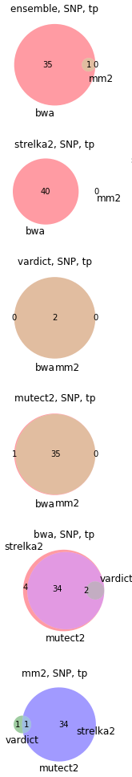
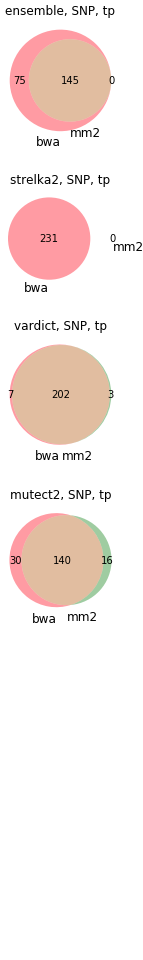

### BWA-MEM vs Minimap2: somatic variant calling 

We evaluated 3 variant callers ran from data from 2 different aligners (BWA-MEM and Minimap2), on 2 somatic and 1 germline datasets with a curated truth sets. Below, 2-way Venn diagrams show how Minimap2 compare against BWA-MEM for each caller.

`MB` - [somatic T/N ICGC medulloblastoma dataset](https://www.nature.com/articles/ncomms10001)


`COLO` - [somatic T/N COLO829 dataset](https://www.ncbi.nlm.nih.gov/pmc/articles/PMC4837349)


`GiaB` - germline GiaB NA12878


Our goal was to understand if we can replace BWA-MEM with a faster Minimap2 in our cancer variant calling pipleine, and generally they seem to show a reasonably similar performance. However, if you look at the FN column, in all 3 datasets Strelka2 seem to generally miss more SNPs with Minimap2 compared to BWA-MEM. In contrast, 1. that doesn't seem to happen with indels; 2. VarDict and Mutect2 don't show significant discrepancy between aligners. We guess that Strelka2 might make some assumptions based on some BWA-MEM features (SAM flags, etc.) that might be reported differrently in Minimap2, with other callers ignoring those features.

All 40 false negative SNPs from the `MB` study were rejected by Strelka2 as having a `LowEVS`. From 246 `COLO` false negative SNPs, 15 were not detected, and the rest rejected with `LowEVS`. We tried to check if there are any significant alignment differences in those sites, like in the coverage depth, mapping quality, etc. On average, the difference in DP and MQ stands out a bit:
```
                     BWA minus Minimap2
mb: DP               +2.83
mb: AF               +0.01
mb: MQ               +0.99
mb: ReadPosRankSum   -0.04
mb: SomaticEVS       +3.36
```

```
                    BWA minus Minimap2 
colo: DP            +20.56
colo: AF              0.00
colo: MQ             +2.73
colo: ReadPosRankSum -0.09
colo: SomaticEVS     +3.83
```
Though eyeballing one variant (1:50,854,774 from `MB`), it doesn't seem clear why the EVS differs significantly. Mapping look very similar in IGV: 
```
Minimap2         BWA:
```
 
```   
Minimap2       	   BWA   
Total count: 76            Total count: 77   
A : 0                      A : 0 
C : 6 (8%, 2+, 4- )        C : 6 (8%, 2+, 4- ) 
G : 0                      G : 0 
T : 70 (92%, 35+, 35- )    T : 71 (92%, 36+, 35- )
N : 0                      N: 0
```

And VCF tags seem to be very close as well (`MQ` 59.89 vs. 58.84, Tier1-`DP` 74 vs. 72, Allelic depth is 6 for both calls, `ReadPosRankSum` is close to 0 for both. However, `SomaticEVS` differs quite a lot (12.82 vs. 6.77):
``` Strelka2 BWA (batch1-strelka2-annotated-bwa.vcf.gz)
1       50854774        .       T       C       .       PASS    AC=1;AF=0.25;AN=4;DP=159;MQ=59.89;MQ0=0;NT=ref;QSS=75;QSS_NT=75;ReadPosRankSum=-0.14;SGT=TT->CT;SNVSB=0;SOMATIC;SomaticEVS=12.82;TQSS=1;TQSS_NT=1;ANN=C|intergenic_region|MODIFIER|RP11-183G22.1-HMGB1P45|ENSG00000234080-ENSG00000229316|intergenic_region|ENSG00000234080-ENSG00000229316|||n.50854774T>C||||||     GT:AU:CU:DP:FDP:GU:SDP:SUBDP:TU 0/0:0,0:0,0:78:0:0,0:0:0:78,82  0/1:0,0:6,6:74:0:0,0:0:0:68,71
```
``` Strelka2 Minimap2 (mb_strelka_snp_uniq_fn.normalised.vcf.gz)
1       50854774        .       T       C       .       LowEVS  AC=1;AF=0.25;AN=4;DP=158;MQ=58.84;MQ0=0;NT=ref;QSS=75;QSS_NT=75;ReadPosRankSum=-0.03;SGT=TT->CT;SNVSB=0;SOMATIC;SomaticEVS=6.77;TQSS=1;TQSS_NT=1;ANN=C|intergenic_region|MODIFIER|RP11-183G22.1-HMGB1P45|ENSG00000234080-ENSG00000229316|intergenic_region|ENSG00000234080-ENSG00000229316|||n.50854774T>C||||||;TUMOR_AF=0.0833333333333;NORMAL_AF=0.0;TUMOR_DP=72;NORMAL_DP=77;TUMOR_MQ=58.84000015258789     GT:AU:CU:DP:FDP:GU:SDP:SUBDP:TU 0/0:0,0:0,0:77:0:0,0:0:0:77,82  0/1:0,0:6,6:72:0:0,0:0:0:66,70
```

This variant was also cought by Mutect2, and missed by VarDict. That does seem to be a pattern for `MB`: of 40 strelka2-missed variants, only 2 were reported by VarDict, and 35 were reported by Mutect2 (consistently in BWA and Minimap2 case):

 

For `COLO` however, both VarDict and Mutect2 did a better job and reported the majority of 231 variants missed by strelka2:



Our question is if the discrepancy for Strelka2 comes from the alignment decisions Minimap2 makes differently from BWA, or it might have to do with different ways to calculate and report particular SAM tags that Strelka2 is using?

